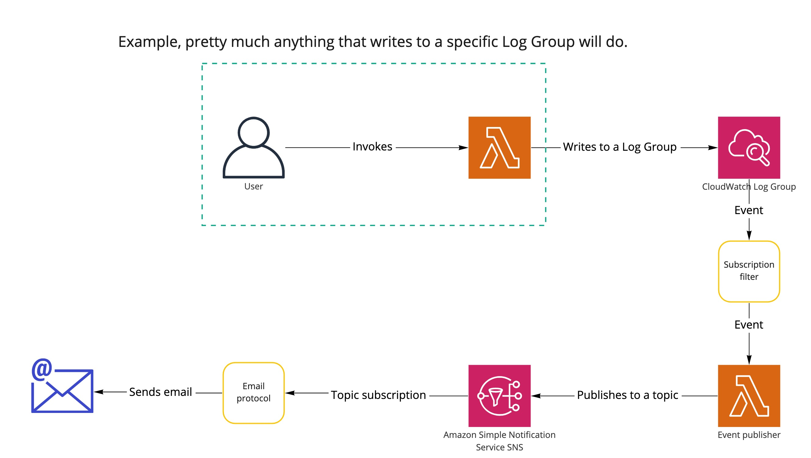

# CloudWatch Log Group events -> Email

## Deployment

1. Change the email address in the `lib/cloudwatch-logs-email-stack.ts` file

1. `npm install`

1. `npm run bootstrap`

1. `npm run deploy`

## Playing around

1. Confirm the SNS subscription (email).

1. Invoke the `Function` Lambda Function.

1. Check your email.
